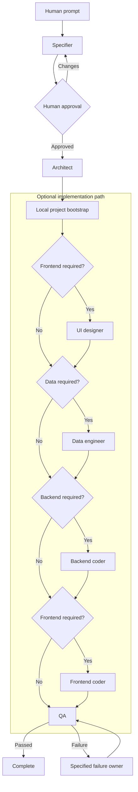

# Web App Dev Team

Seven Codex roles build internal business applications. The orchestrator uses
validated and deterministic handoffs.

```text
specifier -> human review -> architect
architect -> [ui-designer] -> [data-engineer] -> [backend-coder] -> [frontend-coder] -> QA
```

Square brackets identify optional roles. The architect sets `dataRequired`,
`backendRequired`, and `frontendRequired`. The orchestrator calculates the
route.

QA is the only role that can complete a run. QA sends each failure to one
specified owner.

For a new project, a local bootstrap creates the fixed project files. It does
not replace files in an existing project. It installs the dependencies and runs
the initial checks before a specialist starts.



A specialist can send a technical conflict to the architect. The architect
then changes the technical plan.

## Product conventions

```text
src/
  contexts/<context>/{application,domain,infrastructure}
  apps/<application-name>/{backend,frontend}
test/                         # Has the same structure as src/
drizzle/                      # Contains committed SQL migrations
.data/                        # Contains ignored SQLite files
```

The fixed stack is TypeScript 7, Bun, tRPC v11, Zod, OpenAPI 3.1, Swagger UI,
Drizzle, `bun:sqlite`, React, Vite, TanStack Router, TanStack Query, Tailwind,
shadcn/ui, and Playwright.

The internal API uses the alpha `@trpc/openapi` package. Pin its version. Do not
use this API as a public compatibility contract.

## Requirements and run

Install Bun, tmux, and an authenticated `codex` CLI. If tmux is not available,
the application stops before it changes the target project.

```bash
bun run start -- \
  --workspace /absolute/path/to/project \
  --prompt "Add approval rules to purchase orders"
```

Use `--detach` to keep the tmux session in the background. The tmux window shows
the seven role logs. The specifier waits for `a` to approve or `c` to request
changes.

The application stores runs in
`<workspace>/.web-app-dev-team/runs/<run-id>/`.

## Specifications and restitution

After human approval, the application adds an immutable Gherkin file and hash
to `specifications/manifest.json`.

Restitution implements the specifications in creation order. It does not use
the specifier or human review. It records a checkpoint only after QA completes.

```bash
bun run restore -- \
  --workspace /absolute/path/to/fresh-project \
  --specs-path /absolute/path/to/specifications

bun run restore:resume -- --restore-dir /absolute/path/to/restitution-run
bun run restore:status -- --restore-dir /absolute/path/to/restitution-run
```

Use `--max-turns 24` with `restore:resume` to increase an exhausted turn limit.

## Configuration

```dotenv
WEB_APP_DEV_TEAM_MODEL=gpt-5.6-sol
WEB_APP_DEV_TEAM_MAX_TURNS=12
WEB_APP_DEV_TEAM_MAX_COMPLEXITY=10
WEB_APP_DEV_TEAM_ARCHITECTURE_GUARD=on
```

The turn-limit precedence is
`--max-turns > WEB_APP_DEV_TEAM_MAX_TURNS > 12`.

One turn is one accepted agent execution. A skipped role does not use a turn.
Each restitution specification has a separate turn limit. A CLI option does not
change `.env`.

After each code-writing role, local checks examine structure and complexity.
Before QA, the checks also run the available format, lint, typecheck, unit,
integration, and E2E scripts.

A failed check returns the work to the active role.

## Customize and verify

Role instructions are in `roles/*.md`. Structured output schemas are in
`schemas/`. The shared communication rules are in
`config/simplified-technical-english.md`.

```bash
bun run demo
bun run complexity
bun run typecheck
bun test
```

## TODO

- Add Git management for worktrees, branches, commits, conflicts, and rollback.
- Add DevOps management for CI, environments, secrets, deployments, and rollback.
- Define how the data engineer gets database access.
- Add durable inboxes, outboxes, queues, and concurrency.
- Add retry, cancellation, and tmux recovery policies.
- Add versioned bootstrap templates and safe template updates.
- Add project-specific stack configuration and additional backends.
- Add optional human checks after specification approval.
- Add artifact integrity, retention, and cleanup policies.
