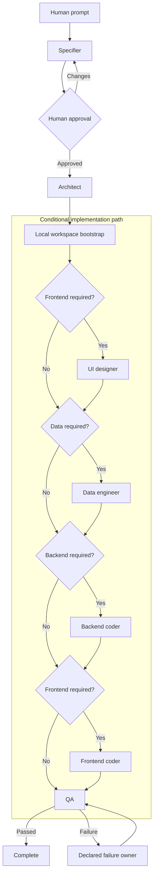

# Web App Dev Team

Seven specialized Codex roles build internal business applications through
schema-validated, deterministic handoffs:

```text
specifier -> human review -> architect
architect -> [ui-designer] -> [data-engineer] -> [backend-coder] -> [frontend-coder] -> QA
```

Brackets are conditional. The architect emits `dataRequired`, `backendRequired`
and `frontendRequired`; the orchestrator calculates the route. Specialists may
return technical contradictions to the architect. QA is the only role that can
complete and routes failures to one declared owner.

After the architect, a versioned local bootstrap creates the fixed boilerplate
when the target has no project files. Specification and team metadata do not
make a workspace non-empty. Existing projects are detected conservatively and
never overwritten. The decision and created-file list are persisted in the run
state and shown in every tmux pane. A new project is dependency-installed and
must pass format, lint, typecheck and starter tests before any specialist runs.



The orchestrator skips every optional role not selected by the architect's
change plan. QA sends a failure to its declared owner, which corrects the change
before it returns to QA. Any specialist may return a technical contradiction to
the architect.

## Product conventions

```text
src/
  contexts/<context>/{application,domain,infrastructure}
  apps/<application-name>/{backend,frontend}
test/                         # mirrors src/
drizzle/                      # committed SQL migrations
.data/                        # ignored SQLite files
```

The fixed stack is TypeScript 7, Bun, tRPC v11, Zod, generated OpenAPI 3.1 and
Swagger UI, Drizzle with `bun:sqlite`, React, Vite, TanStack Router/Query,
Tailwind, shadcn/ui and Playwright. `@trpc/openapi` is intentionally accepted as
an alpha dependency for internal APIs and should be version-pinned.

## Requirements and run

Requires Bun, an authenticated `codex` CLI and tmux. If tmux is missing, startup
exits before touching the target workspace.

```bash
bun run start -- \
  --workspace /absolute/path/to/project \
  --prompt "Add approval rules to purchase orders"
```

Use `--detach` to avoid attaching. The seven role logs remain visible in one
tiled tmux window. The specifier pauses for `a` (approve) or `c` (request changes).
Runs live in `<workspace>/.web-app-dev-team/runs/<run-id>/`.

## Specifications and restitution

Human approval appends immutable Gherkin files and hashes to
`specifications/manifest.json`. Restitution replays them in creation order,
without specifier or human review, and checkpoints only after QA:

```bash
bun run restore -- \
  --workspace /absolute/path/to/fresh-project \
  --specs-path /absolute/path/to/specifications

bun run restore:resume -- --restore-dir /absolute/path/to/restitution-run
bun run restore:status -- --restore-dir /absolute/path/to/restitution-run
```

Extend an exhausted restitution with `--max-turns 24` on `restore:resume`.

## Configuration

```dotenv
WEB_APP_DEV_TEAM_MODEL=gpt-5.6-sol
WEB_APP_DEV_TEAM_MAX_TURNS=12
WEB_APP_DEV_TEAM_MAX_COMPLEXITY=10
WEB_APP_DEV_TEAM_ARCHITECTURE_GUARD=on
```

Turn-limit precedence is `--max-turns > WEB_APP_DEV_TEAM_MAX_TURNS > 12`.
One turn is one accepted agent execution; skipped roles consume none. The limit
applies independently to each restitution specification. A CLI override does
not modify `.env`.

Local structural and complexity checks run after every code-writing specialist.
Before QA, the gate also runs all available format, lint, typecheck, unit,
integration and E2E scripts. Failures return to the responsible active role.

## Customize and verify

Role instructions live in `roles/*.md`; structured outputs live in `schemas/`.

```bash
bun run demo
bun run complexity
bun run typecheck
bun test
```

## TODO

- Git management: isolated worktrees, branches, commit handoffs, conflict rules
  and recoverable rollback.
- DevOps management: CI pipelines, environments, secrets, deployments,
  observability and rollback verification.
- Define the data engineer's database access policy: MCP tools, deterministic
  local scripts, direct read-only inspection and mutation boundaries.
- Durable inboxes/outboxes, queues and concurrency.
- Retry policies, cancellation and tmux session recovery.
- Additional versioned bootstrap templates and safe template upgrades.
- Project-local stack overrides and additional backends.
- Optional human gates beyond specification approval.
- Artifact integrity, retention and cleanup policies.
